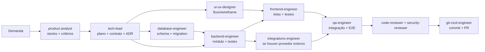

# Workflow com agentes especialistas

Cada agente em `.claude/agents/` tem contexto técnico próprio, ferramentas limitadas ao que precisa
e uma área de responsabilidade ("dono" de pastas). Eles trabalham de forma independente e se comunicam
por **artefatos no repositório** (planos, schemas Zod, migrations, ADRs), não por memória.

## Mapa de responsabilidades

| Área | Dono | Revisores |
|---|---|---|
| `docs/adr/`, planos de feature | `tech-lead` | — |
| `docs/product/` | `product-analyst` | `tech-lead` |
| `docs/design-system.md`, tema Tailwind | `ui-ux-designer` | `frontend-engineer` |
| `packages/shared` (contratos Zod) | `backend-engineer` | `frontend-engineer`, `tech-lead` |
| `apps/api/prisma/` | `database-engineer` | `backend-engineer` |
| `apps/api/src/modules/*` | `backend-engineer` | `code-reviewer` |
| `apps/api/src/modules/{notifications,payments,integrations}` | `integrations-engineer` | `security-reviewer` |
| `apps/web/` | `frontend-engineer` | `code-reviewer` |
| `apps/*/test`, `e2e/` | `qa-engineer` | — |
| `infra/`, Dockerfiles | `devops-engineer` | `security-reviewer` |
| `.github/` | `git-cicd-engineer` | `devops-engineer` |

## Ciclo de uma feature

1. **Descoberta** — `product-analyst` escreve `docs/product/<feature>.md` com stories e critérios Gherkin.
2. **Plano** — `tech-lead` gera `docs/plans/<feature>.md`: contrato (Zod + endpoints), mudanças de banco,
   tarefas por agente e dependências. Decisões estruturais viram ADR.
3. **Execução em paralelo quando não há dependência** — ex.: `ui-ux-designer` e `database-engineer`
   simultaneamente; `frontend-engineer` pode começar com o contrato Zod e mocks antes da API ficar pronta.
4. **Qualidade** — `qa-engineer` valida critérios de aceite; `code-reviewer` e (se aplicável)
   `security-reviewer` revisam o diff.
5. **Entrega** — `git-cicd-engineer` cria branch/commits/PR; CI precisa estar verde.

## Como acionar

No Claude Code, basta pedir em linguagem natural — o agente é escolhido pela `description`:
> "Use o tech-lead para planejar a feature de agendamento online."
> "Peça ao database-engineer para modelar profissionais, serviços e agendamentos."

Ou explicitamente com `@agente` / `/agents` para listar e editar.
Para trabalho paralelo que mexe nos mesmos arquivos, use isolamento por **git worktree**.

## Regras de colaboração
- Nenhum agente altera área de outro dono sem registrar no plano da feature.
- Mudou contrato (`packages/shared`)? Avise no plano — front e back dependem dele.
- Ao terminar, cada agente reporta: o que fez, arquivos alterados, como verificar, pendências.
